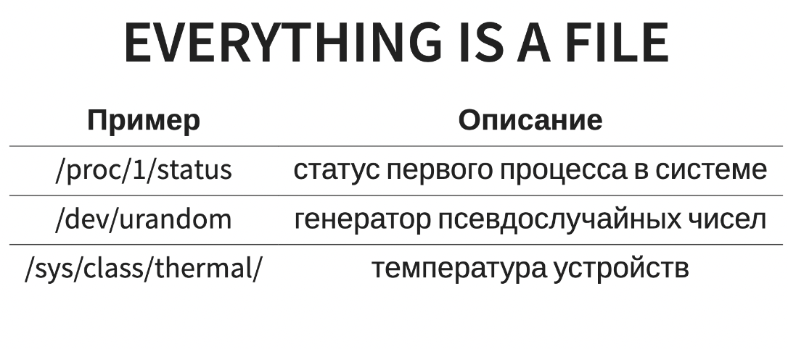

# Семинар №1

---

## Инструменты командной строки и Git

---

### Командная строка

---

У компьютеров сейчас уже очень много интерфейсов работы, будь то полностью
графический, как в Windows, будь то уже голосовой, как у ассистентов. Но они
достаточно ограничены в своих действиях &mdash; мы пока не умеем голосом объяснять
любые команды или UX может быть ограниченным. Исторически так сложилось (и по
существу), что текстовые интерфейсы самые гибкие и намного проще для реализации.
Откуда появился старый добрый Shell.


Все платформы, которые Вы используете, имеют тот или иной shell. Сегодня мы
поговорим о самом популярном shell &mdash; Bourne Again SHell, или "bash" как его
ещё называют. Чтобы открыть терминал, который запустит Вам bash на Ubuntu,
надо ввести shortcut `Ctrl + Alt + T`, на MacOS нет дефолтного шортката, поэтому
надо через поиск или графический интерфейс. Если у Вас что-то другое, Вы уже
сами знаете, как открывать терминал.

Когда Вы открываете терминал с bash, у Вас перед глазами будет что-то похожее
на следующее:

```bash
m.v.tsion@MacBook-Air-Mikhail ~ %
```

Это основной текстовый интерфейс. Он показывает Вам, кто Вы, на какой машине, и
где Вы находитесь. Первый `m.v.tsion` &mdash; это кто я, второй `MacBook-Air-Mikhail` &mdash;
машина на которой я нахожусь. `~` &mdash; стандартное обозначение `home` директории
в Вашей системе, `$` или `%` обозначает, что Вы не `root` пользователь.

Дальше shell предоставляет Вам исполнять команды

```bash
m.v.tsion@MacBook-Air-Mikhail ~ % whoami
m.v.tsion
m.v.tsion@MacBook-Air-Mikhail ~ % hostname
MacBook-Air-Mikhail
```

Как они исполняются? Как и в языках программирования, в Shell есть глобальные
переменные, которые Вас окружают. В bash одна из основных глобальных переменных &mdash;
это `$PATH`. Ещё такие переменные называются переменными окружения. Чтобы их
вывести, надо обязательно перед ними поставить знак `$`, а команда `echo` умеет
выводить **аргументы командной строки**, причём `echo` ничего не знает про
`$PATH` &mdash; сам bash раскрывает эту переменную при исполнении.

```bash
m.v.tsion@MacBook-Air-Mikhail ~ % echo PATH
PATH
m.v.tsion@MacBook-Air-Mikhail ~ % echo $PATH
/usr/local/sbin:/usr/local/bin:/usr/sbin:/usr/bin:/sbin:/bin
# или /opt/homebrew/bin:/usr/local/bin:/usr/bin:/bin:/usr/sbin:/sbin на MacOs
```

Теперь, когда Вы пишите любую команду, shell поочередно смотрит на все пути,
указанные в `$PATH`, и исполняет эту команду. Конфликты решаются по первому
попавшемуся пути в переменной. Например, у меня бинарный файл `whoami` на самом
деле лежит по `/usr/bin/whoami`. Вы можете это узнать, написав команду `which`.

```bash
m.v.tsion@MacBook-Air-Mikhail ~ % which whoami
/usr/bin/whoami
m.v.tsion@MacBook-Air-Mikhail ~ % which which
/usr/bin/which
```


Кстати, про навигацию внутри файловой системы. В Linux системах всё находится
под одной точкой, называемой "root" или `/`. Все остальные файлы, девайсы
находятся под `/`. Основные команды для навигации:

```bash
m.v.tsion@MacBook-Air-Mikhail ~ % pwd
/Users/m.v.tsion  
# /home/m.v.tsion - в Linux
m.v.tsion@MacBook-Air-Mikhail ~ % cd /home
m.v.tsion@MacBook-Air-Mikhaill /home % pwd
/home
m.v.tsion@MacBook-Air-Mikhail /home % cd ..
m.v.tsion@MacBook-Air-Mikhail / % pwd
/
m.v.tsion@MacBook-Air-Mikhail / % cd ./home
m.v.tsion@MacBook-Air-Mikhail /home % pwd
/home
```




Путь, начинающийся с `/` &mdash; абсолютный путь, иначе он относительный. `.` &mdash; это
текущая директория, `..` &mdash; родительская директория (предыдущая до последнего
`/`), `pwd` &mdash; это команда print working directory.

Стоит отметить, что команда `cd -` вернёт Вас на предыдущую директорию, в
которой Вы были. Бывает полезно, когда Вы прыгаете между двумя директориями. А
`cd ~` вернёт Вас в Вашу home директорию.

Почти все команды работают с текущей директорией. Например, чтобы посмотреть,
что за файлы и папки находятся в текущей директории, достаточно запустить
команду `ls` &mdash; list.

```bash
m.v.tsion@MacBook-Air-Mikhail ~ % ls
Applications            Documents               IdeaProjects            Movies                  Pictures                javasharedresources
Desktop                 Downloads               Library                 Music                   Public
```

У команд как правило есть аргументы (или опции), это то, что вы пишете после
команды. Аргументы неформально делятся на два типа

* Позиционные. Например, `$ cd /etc`, вы передаёте команде `cd` аргумент, что
  надо пойти в директорию `/etc`.
* Опциональные. Это аргументы обычно начинаются с `-` или `--` (как их разделить не знаю, почти везде работает просто `-`). Пример: `$ ls -l` (см. ниже)

Аргументы позиционные и опциональные могут совмещаться

* `$ ls -d /etc`
* `$ ls -dl /etc`, пример, что однобуквенные аргументы в некоторых командах можно склеивать
* `$ ls --author -l .`, пример, когда можно совмещать много различных других аргументов

Сложно, конечно, запомнить аргументы, и они очень несистематичны. Однако, необязательно выискивать в сети эти 
аргументы. Прочитать про команду (назначение, агрументы, флаги, ...) можно узнать с помощью команды `man 
<YOUR_COMMAND>`. Пример:
```bash
m.v.tsion@MacBook-Air-Mikhail ~ % man ls

LS(1)                     BSD General Commands Manual                    LS(1)

NAME
     ls -- list directory contents

SYNOPSIS
     ls [-ABCFGHLOPRSTUW@abcdefghiklmnopqrstuwx1%] [file ...]

DESCRIPTION
     For each operand that names a file of a type other than directory, ls displays its name as well as any requested, associated information.  For each operand that names a
     file of type directory, ls displays the names of files contained within that directory, as well as any requested, associated information.

     If no operands are given, the contents of the current directory are displayed.  If more than one operand is given, non-directory operands are displayed first; directory and
     non-directory operands are sorted separately and in lexicographical order.

     The following options are available:

     -@      Display extended attribute keys and sizes in long (-l) output.

     -1      (The numeric digit ``one''.)  Force output to be one entry per line.  This is the default when output is not to a terminal.

     -A      List all entries except for . and ...  Always set for the super-user.
...
```

Чтобы посмотреть больше информации, у `ls` есть опция `-l`, вывод будет
более полным:

```bash
m.v.tsion@MacBook-Air-Mikhail ~ % ls -l
total 0
drwx------@  3 m.v.tsion  staff    96 Aug 31 15:33 Applications
drwx------@ 13 m.v.tsion  staff   416 Sep 10 20:55 Desktop
drwx------@  7 m.v.tsion  staff   224 Sep  7 22:44 Documents
drwx------+  4 m.v.tsion  staff   128 Sep 10 20:53 Downloads
drwxr-xr-x   2 m.v.tsion  staff    64 Sep  7 22:19 IdeaProjects
drwx------@ 67 m.v.tsion  staff  2144 Sep  7 21:48 Library
drwx------   3 m.v.tsion  staff    96 Aug 31 15:11 Movies
drwx------+  4 m.v.tsion  staff   128 Sep  1 13:35 Music
drwx------+  4 m.v.tsion  staff   128 Aug 31 15:12 Pictures
drwxr-xr-x+  4 m.v.tsion  staff   128 Aug 31 15:11 Public
drwxr-xr-x   3 m.v.tsion  staff    96 Sep  7 22:07 javasharedresources
```

Разберём, что оно выводит. `d` бит показывает, что это директория, первый `rwx`
показывает, что директория может читаться, перезаписываться и входиться от
пользователя `m.v.tsion`. Вторые `r-x` показывают, что группа `staff`
может читать и заходить, третьи показывают `r-x`, что все остальные помимо
owner (m.v.tsion) и owner group (staff) могут читать и заходить. Стоит отметить, что бит `x` это execute, для файлов это 
означает, что 
файл может исполняться (например, скомпилированный бинарный файл или скрипт), а для директорий это возможность в неё входить.
Так как битов по 3, то их представляют в 8-ричной системе счисления и эти
доступы можно менять, например:


```bash
m.v.tsion@MacBook-Air-Mikhail ~ % chmod 775 Movies
m.v.tsion@MacBook-Air-Mikhail ~ % ls -ld Movies
drwxrwxr-x  3 m.v.tsion  staff  96 Aug 31 15:11 Movies
```

Остальные интересные команды для работы с директориями &mdash; это `mv $src $dst`
(move), `cp $src $dst` (copy), `mkdir $dir` (make directory), `rm $file` (remove),
`rmdir $dir` (remove empty directory), `rm -r $dir` (remove recursive),
`touch $file` (touch a file, то есть создание файла).
Другие часто используемые команды:
* `sort`, `uniq` &mdash; сортировка и вывод уникальных
  (вход должен быть отсортированным)
* `grep`, `cut` &mdash; поиск по регулярному выражению и сплит строк
* `head`, `tail` &mdash; вывод первых и последних строк
* `wc` &mdash; подсчёт количества байт, строк в файле и т.д.
* `df` &mdash; статистика использованного места на машине
* `cat`, `tac` &mdash; вывод файла с начала или с конца соответственно
* `echo` &mdash; повторение аргументов
* `find` &mdash; мощная команда для поиска в директории
* `chmod`, `chown`, `sudo` &mdash; изменение permissions и овнеров, работа в режиме super user

Также помимо `man` Вы можете напечатать `<YOUR_COMMAND> --help`. Например:
```bash
m.v.tsion@MacBook-Air-Mikhail ~ % man --help
man, version 1.6g

usage: man [-adfhktwW] [section] [-M path] [-P pager] [-S list]
        [-m system] [-p string] name ...

  a : find all matching entries
  c : do not use cat file
  d : print gobs of debugging information
...
```

**Объединение команд:**

Запускать программы по одной очень хорошо, но иногда хотелось бы вывести вывод
программы в файл или на вход другой программы. Для этого в shell есть множество
способов, основанные на так называемых потоках или файловых дескрипторах.

Самые простые формы перенаправления &mdash; `<file` и `>file`. Первое
обозначает, что вход программы должен браться из `file`, а последнее означает,
что `file` должен перезаписаться выводом программы. `>>file` означает, что в
`file` будет добавлен вывод программы. Рассмотрим простейшие примеры (`cat`,
кстати, команда для прочтения файла или stdin, если запущена без аргументов):

```bash
m.v.tsion@MacBook-Air-Mikhail ~ % echo hello >hello.txt
m.v.tsion@MacBook-Air-Mikhail ~ % cat hello.txt
hello
m.v.tsion@MacBook-Air-Mikhail ~ % cat <hello.txt # нет аргументов, просто запуск из stdin hello.txt
hello
m.v.tsion@MacBook-Air-Mikhail ~ % cat <hello.txt >hello2.txt
m.v.tsion@MacBook-Air-Mikhail ~ % cat hello2.txt
hello
m.v.tsion@MacBook-Air-Mikhail ~ %echo " world" >>hello2.txt
m.v.tsion@MacBook-Air-Mikhail ~ % cat hello2.txt
hello world
```

Также выход одной программы можно перенаправлять на вход другой через оператор
pipe `|`, например:

```bash
m.v.tsion@MacBook-Air-Mikhail ~ % ls -l | head -n 3
total 0
drwx------@  3 m.v.tsion  staff    96 Aug 31 15:33 Applications
drwx------@ 13 m.v.tsion  staff   416 Sep 10 21:07 Desktop
```

Или что-то более сложное:

```bash
m.v.tsion@MacBook-Air-Mikhail ~ % curl --head -s google.com | grep -i content-length | cut --delimiter=' ' -f2
219
```

Последняя команда взяла header сайта google.com, поискала с помощью `grep` слово
`content-length` в любом регистре и вывела 2-й токен с разделителем пробел.

Если Вы хотите исключить весь вывод, стандартным способом является
перенаправление stdout `>/dev/null`.

Стоит отметить, что существует `2>file` &mdash; это перенаправление `stderr` в
`file`. Если Вы хотите полностью исключить любой вывод в консоль, лучший способ
`>/dev/null 2>/dev/null`. А если Вам надо что-то поискать по `stderr`, можно
его перенаправить в `stdout` с помощью `2>&1 | grep $your_token`:

```bash
m.v.tsion@MacBook-Air-Mikhail ~ % man | grep you
What manual page do you want?
```

Вы можете писать множество команд через `&&`, где часть справа выполнится только
если часть слева корректно (с кодом возврата 0) завершилась:

```console
m.v.tsion@MacBook-Air-Mikhail ~ % ls | head -n 5 && echo OK!
Applications
Desktop
Documents
Downloads
IdeaProjects
OK!
```

Иногда Вы можете встретить команду `&`, она делает detach процесса &mdash; это
значит, что процесс принадлежит терминалу (при его закрытии, он умрет), но
shell этот процесс не блокирует, то есть другие команды выполнять можно. Чтобы
быть уверенным, что Ваша команда выполнится в фоне, даже если закрыть терминал,
можно использовать tmux (будет в конце лекции), либо использовать команду
`nohup`:

```bash
m.v.tsion@MacBook-Air-Mikhail ~ % nohup ./server --port=8080 &
```

Всё, сервер работает и будет работать даже если закроете терминал.

---

### Git

---

