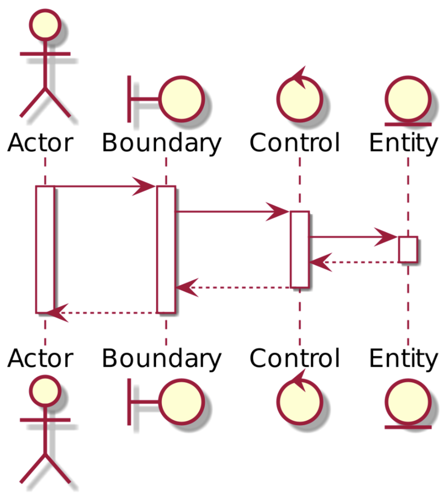

# Семинар №2

---

## UML (Unified Modeling Language)

---

### Унифицированный язык моделирования

UML создан для того, чтобы описывать объект в едином заданном синтаксисе, поэтому где бы вы не нарисовали диаграмму, на 
каком бы языке программирования Вы бы не писали, Вы будете понятны для всех, кто знаком с этим графическим языком — 
даже в другой стране.
  
 * **U**(nified) — (универсальный, единый) — подходит для широкого класса проектируемых программных систем, различных областей приложений, размеров проектов.
 * **M**(odeling) — подразумевает создание модели, описывающей объект.
 * **L**(anguage) — набор соглашений для графического описания.

Одна из задач UML — служить средством коммуникации внутри команды, между командами и при общении с заказчиком. Давайте 
рассмотрим возможные варианты использования диаграмм:
 * must-have при проектировании архитектуры больших проектов — сборка кучи мелких деталей — по чему впоследствии 
   будет строиться код;
 * реверс-инжиниринг — создание UML-модели из существующего кода приложения — формирование документации для готового 
   проекта;
 * из моделей можно извлекать текстовую информацию и генерировать относительно удобочитаемые тексты — 
   документировать, текст и графика будут дополнять друг друга.

Как и любой другой язык, UML имеет собственные правила оформления моделей и синтаксис. С помощью графической нотации UML можно визуализировать систему, объединить все компоненты в единую структуру, уточнять и улучшать модель в процессе работы. На общем уровне графическая нотация UML содержит 4 основных типа элементов:
 * фигуры
 * линии
 * значки
 * надписи

UML-нотация является де-факто стандартом в области разработки программного обеспечения, ИТ-инфраструктуры и бизнес-систем.

Где создавать UML-диаграммы:
 * Diagrams.net
 * Google Drawings
 * xmind.net
 * draw.io
 * gliffy.com

Некоторые из видов диаграмм специфичны для определенной системы и приложения. Самыми доступными из них являются:
 * **Диаграмма прецедентов (Use-case diagram);**
 * Диаграмма классов (Class diagram);
 * Диаграмма активностей (Activity diagram);
 * **Диаграмма последовательности (Sequence diagram);**
 * Диаграмма развёртывания (Deployment diagram);
 * Диаграмма сотрудничества (Collaboration diagram);
 * Диаграмма объектов (Object diagram);
 * **Диаграмма состояний (State diagram)**.

Выделенные диаграммы мы сегодня и рассмотрим.

---

### Диаграмма прецедентов (Use-case diagram)

Диаграмма прецедентов использует 2 основных элемента:

1) Actor (участник) — множество логически связанных ролей, исполняемых при взаимодействии с прецедентами или сущностями (система, подсистема или класс). Участником может быть человек, роль человека в системе или другая система, подсистема или класс, которые представляют нечто вне сущности.

2) Use case (прецедент) — описание отдельного аспекта поведения системы с точки зрения пользователя. Прецедент не показывает, "как" достигается некоторый результат, а только "что" именно выполняется.

**Формальный шаблон имеет вид:**

**Рассмотрим пример:**  

**Диаграмма:**  

**Замечания:**
 * Второй пример можно посмотреть в презентации
 * Диаграмма может содержать более одного актора, тогда стрелочки служат "актору доступен следующий use case"
 * Важно определять границы системы (выделять в квадрат/фигуру), поскольку одна диаграмма может описывать use-cas'ы 
   для нескольких подсистем.

---

### Диаграмма последовательности (Sequence diagram)

Используется для уточнения диаграмм прецедентов — описывает поведенческие аспекты системы. Диаграмма последовательности отражает взаимодействие объектов в динамике, во времени. При этом информация принимает вид сообщений, а взаимодействие объектов подразумевает обмен этими сообщениями в рамках сценария. 
Выделяют:
 * Actor — пользователь/отдельная система в себе
 * Boundary — по сути интерфейс с которым взаимодействуют акторы (web UI, mobile app)
 * Control — бизнес-логика приложения/системы (обычно это серверная часть сайта, или отдельная компонента приложения,
   непосредственно обрабатывающая наши запросы)
 * Entity — данные (обычно это база данных)

**Формальный шаблон имеет вид:**

**Рассмотрим пример:**  
Составить диаграмму для создания комментария к социальной сети.

**Диаграмма:** 

**Замечания:**
* События в диаграмме рассматриваются в хронологическом порядке "сверху-вниз"
* Диаграмма может содержать более одного актора, акторы взаимодействуют не напрямую, а через систему 
  (boundary-control-entity)
* Правильно построенная диаграмма имеет прямое взаимодействие только вида "actor <-> boundary", "boundary <-> 
  control", "control <-> entity"
* Частой ошибкой на диаграмме является то, что boundary, control, entity склеивают в нечто одно абстрактное "Система"

---

### Диаграмма состояний (State diagram)

Диаграмма состояний покажет нам все возможные состояния, в которых может находиться объект, а также процесс смены состояний в результате внешнего влияния. Основными элементами диаграммы состояний являются «Состояние» и «Переход».

**Формальный шаблон имеет вид:**  

**Рассмотрим пример:**  

**Диаграмма:**
